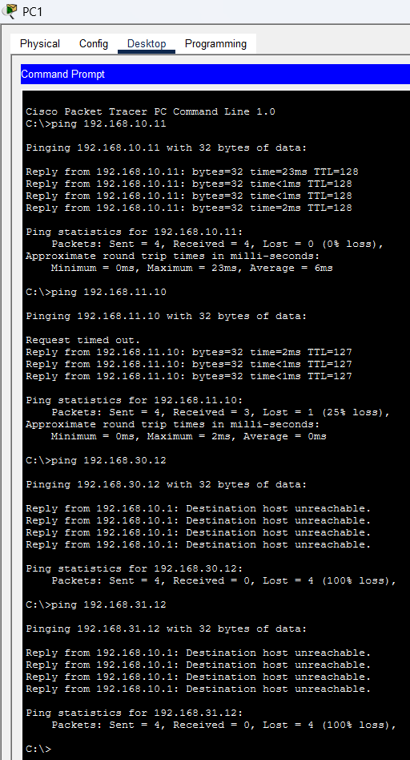
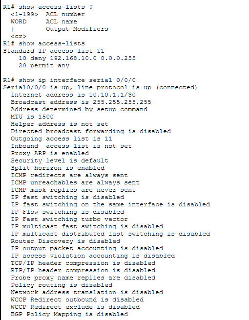
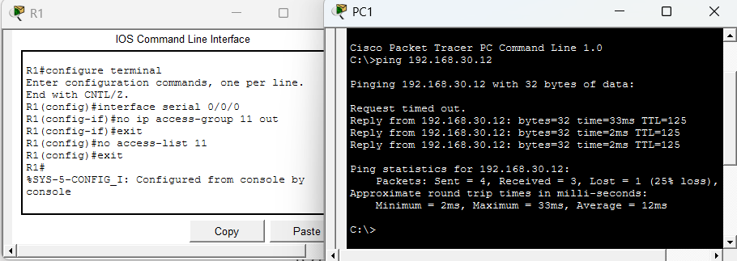

# Laboratorio: Análisis y Remoción de ACL IPv4 Estándar

## Descripción
Este laboratorio práctico aborda el diagnóstico, análisis e intervención sobre una **Lista de Control de Acceso (ACL) Estándar IPv4** configurada en un router Cisco. Se demuestra cómo una regla de filtrado mal ubicada o restrictiva afecta la conectividad hacia subredes remotas y cómo revertir de forma segura dicha configuración para restaurar el flujo de datos.

Este ejercicio fortalece habilidades fundamentales para posiciones Junior en **Networking**, **Infraestructura** y **Analista SOC (Nivel 1)** al ejercitar el troubleshooting de políticas de seguridad en capa 3.

---

## Topología de Red

La topología consta de tres routers (`R1`, `R2`, `R3`), múltiples subredes de clientes (`192.168.10.0/24`, `192.168.11.0/24`, `192.168.30.0/24`) y un servidor DNS remoto (`192.168.31.0/24`).

---

## Objetivos del Laboratorio
1. Diagnosticar problemas de conectividad entre hosts de la LAN local y subredes remotas mediante ICMP.
2. Auditar la configuración de seguridad en el router `R1` utilizando comandos de inspección en Cisco IOS.
3. Desvincular y eliminar de forma ordenada la ACL Estándar afectada.
4. Validar la restauración total de la conectividad en la infraestructura.

---

## Tecnologías y Conceptos Aplicados
* **Cisco IOS CLI**: Configuración y diagnóstico de dispositivos de red.
* **IPv4 Access Control Lists (ACL)**: Filtrado de tráfico de capa 3.
* **Wildcard Masks**: Definición precisa de rangos IP dentro de las reglas de filtrado.
* **ICMP (Ping)**: Pruebas de alcanzabilidad y diagnóstico de mensajes de control (`Destination host unreachable`).

---

## Desarrollo y Diagnóstico Paso a Paso

### Paso 1: Pruebas Iniciales de Conectividad (Troubleshooting)
Desde la PC1 (`192.168.10.x`), se realizaron pruebas de `ping` hacia distintas redes para determinar el alcance del bloqueo:

* **PC1 → PC2 (`192.168.10.11`)**: Exitosa. El tráfico de la misma subred no pasa por la puerta de enlace (router), por lo cual no es afectado por políticas en `R1`.
* **PC1 → PC3 (`192.168.11.10`)**: Exitosa (tras resolución de ARP inicial).
* **PC1 → PC4 (`192.168.30.12`) y DNS Server (`192.168.31.12`)**: **Fallida**. Retorna `Destination host unreachable` desde el gateway `192.168.10.1`, confirmando que el router local está descartando activamente los paquetes salientes.

---

### Paso 2: Auditoría del Router R1
Se accedió a la CLI de `R1` para inspeccionar las reglas activas y su punto de aplicación.

#### A. Inspección de ACLs

    R1# show access-lists
    Standard IP access list 11
        10 deny 192.168.10.0 0.0.0.255
        20 permit any

**Análisis:** La regla 10 bloquea explícitamente todo el tráfico originado en la subred `192.168.10.0/24`.

#### B. Inspección de la Interfaz

    R1# show ip interface serial 0/0/0
    Serial0/0/0 is up, line protocol is up (connected)
      Outgoing access list is 11
      Inbound access list is not set

**Análisis:** Se confirmó que la regla `Outgoing access list is 11` estaba aplicada en sentido de salida (`out`) en la interfaz enlace hacia el resto de la red (`Serial0/0/0`).

---

### Paso 3: Remoción de la ACL y Verificación Final
Para restaurar el servicio, se siguió el procedimiento recomendado por buenas prácticas de administración de redes: **desvincular la ACL de la interfaz antes de eliminar la lista global**.

#### A. Desvinculación de la interfaz

    R1# configure terminal
    R1(config)# interface serial 0/0/0
    R1(config-if)# no ip access-group 11 out
    R1(config-if)# exit

**Nota técnica:** Desvincular primero evita inconsistencias en la memoria del router y previene comportamientos inesperados durante el filtrado.

#### B. Eliminación de la regla global

    R1(config)# no access-list 11
    R1(config)# exit

#### C. Prueba de verificación post-cambio
Se ejecutó nuevamente un `ping` desde **PC1** hacia la **PC4 (`192.168.30.12`)**:

    C:\> ping 192.168.30.12

    Reply from 192.168.30.12: bytes=32 time=33ms TTL=125

**Resultado:** Conectividad restaurada con éxito.

---

## Comandos Utilizados

| Comando | Modo Cisco IOS | Propósito / Explicación |
| :--- | :--- | :--- |
| `show access-lists` | Privilegiado (`#`) | Muestra todas las listas de acceso configuradas y sus estadísticas. |
| `show ip interface [interfaz]` | Privilegiado (`#`) | Muestra los detalles de capa 3 de la interfaz, incluyendo ACLs de entrada/salida. |
| `no ip access-group [Nº] [in\|out]` | Config. Interfaz (`config-if`) | Remueve la vinculación de la ACL sobre la interfaz especificada. |
| `no access-list [Nº]` | Config. Global (`config`) | Elimina la definición de la lista de acceso de la configuración global. |

---

## Conceptos Clave Aprendidos & Impacto en Seguridad

* **Sentido del tráfico (`in` vs `out`):** Una ACL de salida (`out`) evalúa el paquete justo antes de que abandone la interfaz del router, después de tomar la decisión de enrutamiento.
* **Buenas Prácticas para ACL Estándar:** Cisco recomienda colocar las ACL Estándar **lo más cerca posible del destino**, ya que al filtrar solo por IP de origen, colocarlas cerca del origen puede bloquear el acceso a recursos legítimos no deseados (como ocurrió en este lab).
* **Visibilidad SOC / Security Operations:** Identificar un mensaje `Destination host unreachable` emitido por una IP interna suele ser un indicador primario de bloqueo por política de seguridad (ACL, Firewall o Enrutamiento nulo).

---

## Conclusión
Este ejercicio demostró la importancia de auditar las políticas de filtrado antes de asumir fallas físicas o de enrutamiento. La metodología aplicada permitió diagnosticar el origen del bloqueo, aplicar el cambio de forma estructurada y verificar la resolución del incidente de conectividad.
