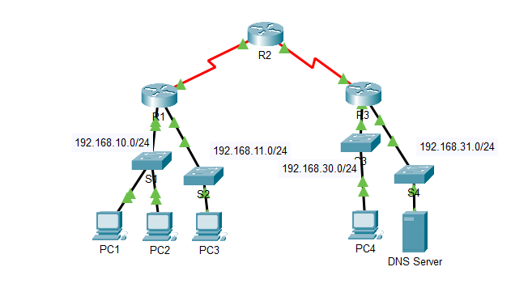

Markdown
# Análisis y Modificación de Listas de Control de Acceso (ACL Standard) en Cisco IOS

## 📌 Descripción

Este laboratorio práctico demuestra el funcionamiento, la auditoría y la eliminación de una **Lista de Control de Acceso IPv4 Estándar (Standard ACL)** en un router Cisco R1. 

Se analiza cómo un filtro de Capa 3 bloquea el tráfico saliente desde una subred de origen específica (`192.168.10.0/24`) hacia segmentos remotos, manteniendo la conectividad local intacta (Capa 2), y cómo la remoción adecuada de la regla restaura el flujo de red.

---

## 🎯 Objetivos

1. **Verificar conectividad local vs. remota** bajo la influencia de una ACL activa.
2. **Auditar e inspeccionar** la configuración de la ACL en Cisco IOS mediante comandos `show`.
3. **Identificar la interfaz y dirección (`in`/`out`)** del filtro de paquetes.
4. **Remover el grupo de acceso de la interfaz y eliminar la ACL** de la configuración global.
5. **Validar la restauración del tráfico ICMP** hacia las redes de destino.

---

## 🛠️ Tecnologías Utilizadas

* **Simulador:** Cisco Packet Tracer
* **Dispositivos:** Routers Cisco IOS (R1, R2, R3), Switches Catalysts (S1, S2, S3, S4), Endpoints (PCs) y Servidor DNS.
* **Protócolos y Conceptos:** IPv4, ICMP, Standard ACL (Capa 3), Switchiing L2, Inbound/Outbound Filtering.

---

## 🗺️ Topología de Red

La red está dividida en múltiples subredes IPv4 interconectadas mediante enlaces seriales entre los routers R1, R2 y R3.



---

## 🧪 Desarrollo y Verificaciones

### Paso 1: Pruebas de Conectividad e Identificación del Bloqueo

Desde **PC1** (`192.168.10.x`), se realizaron pruebas de conectividad ICMP (`ping`) hacia la red local y hacia redes remotas:

1. **Ping a local (`192.168.10.11` - PC2):** **Exitoso**. Al pertenecer a la misma subred, el tráfico se conmuta a nivel de **Capa 2 (Switch S1)** y nunca alcanza el Router R1.
2. **Ping a red remota (`192.168.30.12` - PC4):** **Fallido** (`Destination host unreachable`). El paquete debe cruzar el Router R1 (Capa 3) para ser enrutado, donde es bloqueado por la ACL saliente.


---

### Paso 2: Auditoría e Inspección en el Router R1

Se accedió a la CLI de **R1** en modo privilegiado para auditar la configuración de seguridad:

1. **`show access-lists`**: Reveló la presencia de la **ACL Estándar 11**:
   * `10 deny 192.168.10.0 0.0.0.255` (Bloquea todo el tráfico originado en la subred LAN de PC1).
   * `20 permit any` (Permite cualquier otro tráfico de origen).
2. **`show ip interface serial 0/0/0`**: Confirmó que la ACL 11 está vinculada como filtro saliente:
   * `Outgoing access list is 11`.


---

### Paso 3: Remoción de la ACL y Verificación Final

Para restaurar el tráfico saliente de la subred `192.168.10.0/24`, se procedió a desvincular la ACL de la interfaz serial y posteriormente eliminarla del router:

```cisco
R1# configure terminal
R1(config)# interface serial 0/0/0
R1(config-if)# no ip access-group 11 out
R1(config-if)# exit
R1(config)# no access-list 11
R1(config)# exit
